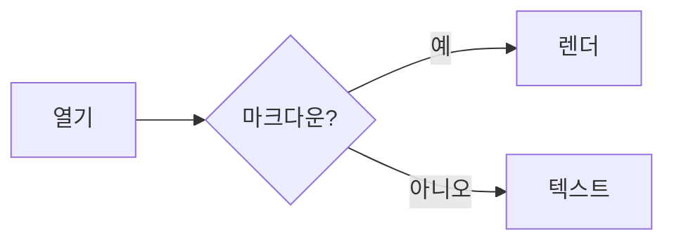

# Marky 샘플 문서

**굵게**, _기울임_, `인라인 코드`, ~~취소선~~, [링크](https://example.com).

## GFM

- [x] 체크된 항목
- [ ] 안 된 항목

| 기능 | 지원 |
| --- | :---: |
| 표 | ✅ |
| 수식 | ✅ |
| 다이어그램 | ✅ |

## 코드

```ts
function greet(name: string): string {
  return `Hi, ${name}`
}
```

## 수식

인라인 $E = mc^2$, 블록:

$$
\int_0^\infty e^{-x^2}\,dx = \frac{\sqrt{\pi}}{2}
$$

## 다이어그램



> 파일을 저장하면 자동으로 새로고침됩니다.
